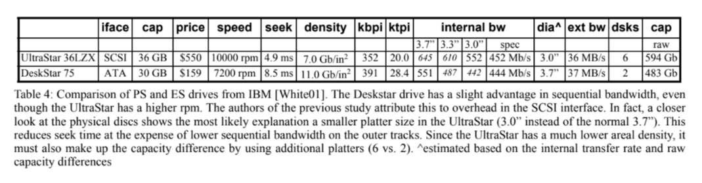
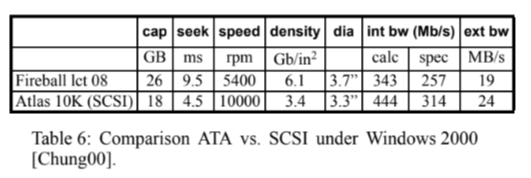

# More than an interface - SCSI vs ATA

## A paper review

\
\
\
\
\
\
Joel Tony $\quad\quad\quad\quad\quad\quad$ Nirmal Govindaraj
2021A7PS2077G $\quad\ \ \quad$ 2021A7PS0441G

---

## Introduction

| Personal Storage (PS)        | Enterprise Storage (ES)                 |
|----------------------------- |---------------------------------------- |
| HDDs for personal computers  | HDDs for enterprises                    |
| Single user                  | Multiple simultaneous users             |
| Home use                     | Strong reliability - business critical  |
| Cost is deciding factor      | Performance is deciding factor          |
| Used alone                   | Used in groups                          |

---

## Functional Requirements

### Seek performance

- Faster head movement
- Done by better actuators, larger magnets, vibration resilience

### Rotational latency

- Make platter spin faster
- Innovations trickle down from ES to PS

<!-- todo add graph -->

---

### Aggregration

- ES drives used in groups $\rightarrow$ More external vibration
- Redundant paths from host to HDD
- ATA supports atmost 2 HDD's
- SCSI controllers support more than 2 HDD's.

---

## Advantages of SCSI

- *IDE* - Programmed I/O, *SCSI* - external controller chip
- Command queue processing
- Multiple CPU support
- Variable block size $\rightarrow$ EDP
- Dual porting $\rightarrow$ controller failover

---

## Tech differences

<!-- figure 2 -->
$\quad\quad\quad\quad$ 

---

## Mechanics

### Actuator

- Larger magnets $\rightarrow$ Control $\uparrow \quad$ Seek performance $\uparrow$
- Latch reduces seek performance near it
  - Magnetic interference
  - Bi-stable latch $\rightarrow$ No performance loss

---

### HDA (Head/Disc assembly)

- 1,000,000+ hour MTBF acheived by
  - Particle filters
  - Dessicants and Active Carbon
  - Shrouding

### Spindle

- Moving faster is a tremendous engineering challenge
  - Increased windage (airflow between disk and arm)
  - Mis-read/mis-write

---

## Electronics

### Control processor

- Handles read/write
- Servo bursts
  - Fields of positional information $\rightarrow$ Identify head's current position
  - Interspersed among data blocks

---

### Servo processor

- Servo operations - Rotation, Speed, Direction adjustment
- More TPI $\rightarrow$ More servo processing
- Runout - Head is unable to follow the track
  - Repeatable runout $\textemdash$ same on each rotation $\textemdash$ caused by platter waviness, motor variation
  - Non repeatable $\textemdash$ external influences $\textemdash$ Harder to solve

---

### Interface

- Significantly more Silicon in ES products
- ES have 2 processors
  - Control processor - Read/Write and interfacing
  - Servo processor - Only performs servo calculations
- PS have only one processor
- SCSI command set is also more comprehensive

---

## Magnetics

- Writes - Data rate and latency improved by higher RPM, sensitive to linear velocity
- Reads - Can be adverally affected by high RPM because of noiser magnetic environment (Recording stress), insensitive to linear velocity
- Anti-ferromagnetic coupled media reinforces magnetic field

---
<!-- figure 3 -->
$\quad\quad\quad$ 

---

## Perfomance Differences

### Capacity

- $\text{Power} \propto (\text{RPM})^3$
- ES use smaller platters $\textemdash$ RPM $\uparrow\quad$ Seek performance $\uparrow$
- But for the same capacity more platters needed $\rightarrow$ costly
- PS drives $\rightarrow$ larger platters, lower RPM $\rightarrow$ cheaper per GB
- Trend towards depopulated drives (1 surface per platter) $\rightarrow$ Performance $\uparrow\quad$ Capacity $\downarrow$

---

$\quad\quad$ 

---

### Random I/O

ES drives have:

- Stronger seek scheduling making seeks ~3x faster compared to PS
- \>2x random perfomance (on average)
- Lower duty cycle

---

$\quad\quad$ 

---

$\quad\quad$ 
<!-- figure 7 to show trend and table 2 to show impact of queue scheduling -->

---

### Rotational vibation

<!-- Use figure 8 to explain 30 rad/s^2 and 60 rad/s^2 -->

- PS drives way more susceptible to rotational vibration
- ES drives designed to work in cabinet with other drives
- Even cabinet design can affect rotational vibrations drastically

---

$\quad\quad$ 

---

### Reliability

- PS - 8 hrs/day 300 days/year, ES - 24 hrs/day, 365 days/year
- AFR highly depends in design choices
<!-- Use figure 9, 10, 11 to explain formulas -->

---

- AFR $\propto$ POH
$\quad$ 

---

- AFR $\propto$ Duty cycle (stronger correlation with more platters)
$\quad$ 

---

- AFR $\propto$ Temperature
$\quad$ 

---

## Related work

<!-- Use table 4, 5, 6 to illustrate related studies -->
- Many studies have been conducted comparing SCSI vs IDE
- Results depend a lot on design choices
- General observation - with similar conditions SCSI perform better than IDE

---

$$\quad$$
$$\quad$$

---

$$\quad$$
$$\quad$$

---

$$\quad$$
$$\quad$$

---

## Conclusion

- In order to compare to drive models a detailed comparison of drive specifications is needed
- All the factors explained before contribute to perfomance and we cannot compare solely based on interface (ATA vs SCSI)

---
<!-- _class: lead invert-->

## Questions?
